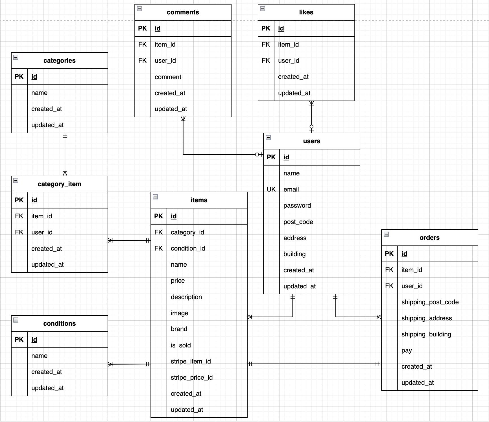

# フリマアプリ

## 環境構築
**Dockerビルド**
1. git clone git@github.com:shiba013/flea-market-app.git
2. cd flea-market-app
3. DockerDesktopアプリを立ち上げる
4. `docker-compose up -d --build`

> *MacPCの場合、`no matching manifest for linux/arm64/v8 in the manifest list entries`のメッセージが表示されビルドができないことがあります。
エラーが発生する場合は、docker-compose.ymlファイルの「mysql」内に「platform」の項目を追加で記載してください*
``` bash
mysql:
    platform: linux/x86_64(この文追加)
    image: mysql:8.0.26
    environment:
```

**Laravel環境構築**
1. `docker-compose exec php bash`
2. `composer install`
3. 「.env.example」ファイルを 「.env」ファイルに命名を変更。または、新しく.envファイルを作成
4. .envに以下の環境変数を追加
``` text
DB_CONNECTION=mysql
DB_HOST=mysql
DB_PORT=3306
DB_DATABASE=laravel_db
DB_USERNAME=laravel_user
DB_PASSWORD=laravel_pass
```

5. 認証メールアドレスの設定
ユーザ登録時にメール認証が必要です。認証メールを受信するメールアドレスを設定してください。<br>
(下記メールアドレスは、本プロジェクトでのみ使用可能です。)
``` text
MAIL_MAILER=smtp
MAIL_HOST=smtp.gmail.com
MAIL_PORT=587
MAIL_USERNAME=damikun150@gmail.com
MAIL_PASSWORD=vfusowrjenjpptvt
MAIL_ENCRYPTION=tls
MAIL_FROM_ADDRESS=damikun150@gmail.com
MAIL_FROM_NAME="My App Name"
```
> このメール認証では「ログインセッション」を使用します。<br>
> 認証リンクをクリックする際は、必ず 「ログイン中の同じブラウザ」 でアクセスしてください。

6. アプリケーションキーの作成
``` bash
php artisan key:generate
```

7. 画像表示のためのシンボリックリンクの設定
``` bash
php artisan storage:link
```

8. マイグレーションの実行
``` bash
php artisan migrate
```

9. シーディングの実行
``` bash
php artisan db:seed
```

10. laravelとstripeとの同期設定(商品登録)
``` bash
php artisan sync:stripe-items
```

**stripe環境構築**
1. Stripeのアカウント作成
> 公式サイトを参照してStripeのアカウント作成を作成してください。<br>
> 公式サイト：https://dashboard.stripe.com/

2. stripe向けのパッケージのインストール
``` bash
docker-compose exec php bash
composer require stripe/stripe-php
```

3. Stripe CLIのインストール
StripeのCLIツールをインストールする必要があります。以下のコマンドを実行してインストールしてください。
```bash
brew install stripe/stripe-cli/stripe   # homebrewを使用する場合
```
> 他のOSの場合、公式サイトを参照してインストールしてください。<br>
> 公式サイト：https://docs.stripe.com/stripe-cli

4. Stripeにログイン
Laravel プロジェクトのルートディレクトリで実行
``` bash
stripe login
```

5. 環境変数の設定
> .env ファイルに以下の設定を追加してください。必要な情報はStripeダッシュボードから取得できます。
``` text
STRIPE_SECRET_KEY=your_stripe_secret_key
STRIPE_PUBLIC_KEY=your_stripe_public_key
```

6. Webhookイベントの転送設定
下記のコマンドを実行した際に取得できるwebhookのシークレットキーを.env ファイルに設定を追加してください。
``` bash
stripe listen --forward-to http://localhost/stripe/webhook
```
``` text
STRIPE_WEBHOOK_SECRET=your_stripe_webhook_secret
```
> コマンドを実行する際、stripeにログインした状態で行ってください。<br>
> また、コマンド実行後、購入処理を完了させる際に必要なため終了しないようにしてください。

**単体テスト環境構築**
1. `docker-compose exec php bash`
2. `composer install`
3. 「.env.example」ファイルを 「.env.testing」ファイルに命名を変更。または、新しく.envファイルを作成
4. .envに以下の環境変数を追加
``` text
APP_ENV=test
DB_CONNECTION=mysql
DB_HOST=mysql
DB_PORT=3306
DB_DATABASE=demo_test
DB_USERNAME=root
DB_PASSWORD=root
STRIPE_SECRET_KEY=your_stripe_secret_key
STRIPE_PUBLIC_KEY=your_stripe_public_key
STRIPE_WEBHOOK_SECRET=your_stripe_webhook_secret
```

5. アプリケーションキーの作成
``` bash
php artisan key:generate
```

6. 単体テストの実行
``` bash
php artisan test --filter テストファイル名
```

## 動作確認時の注意事項
左上のCOACHTECHロゴをクリックすることでトップページへ遷移することができる。

> 購入処理を行う際、下記設定を参照して行うようにしてください。
- コンビニ決済の場合
``` text
メールアドレス：succeed_immediately@test.com
名前：任意の名前
電話番号：22222222220
```
コンビニ決済の画面遷移後、PCの画面更新を実行することで支払い完了画面が表示されます。<br>
その後については、stripeの仕様により画面遷移できないため、http://localhost/ へ手動にて画面遷移してください。

- カード決済の場合
``` text
メールアドレス：任意のメールアドレス
カード番号：4242 4242 4242 4242
カード有効期限：未来の年月
セキュリティコード：任意の3桁の数字
カード保有者の名前：任意の名前
国または地域：任意の国名を選択
```

## 使用技術(実行環境)
- PHP(8.3.0)
- Laravel(8.83.29)
- MySQL(8.0.26)
- Fortify(1.19.1)
- stripe(17.1.1)

## ER図


## URL
- 開発環境：http://localhost/
- phpMyAdmin:：http://localhost:8080/